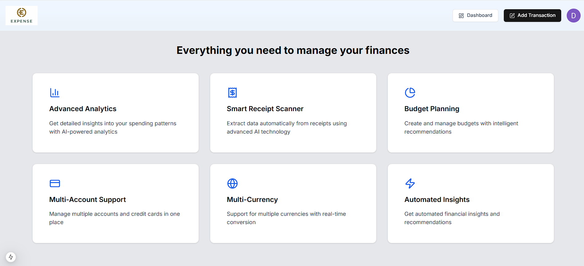
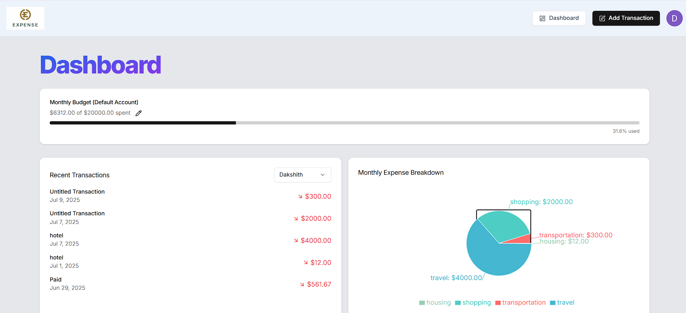
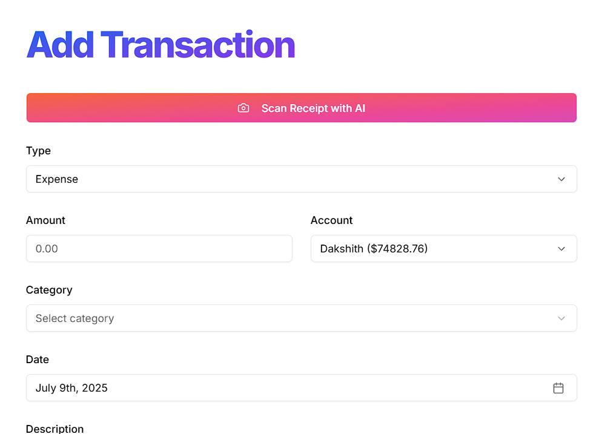
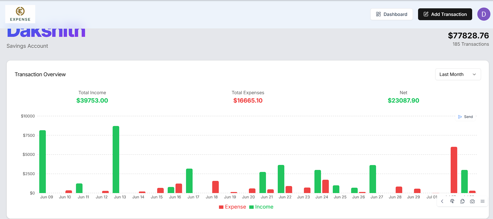
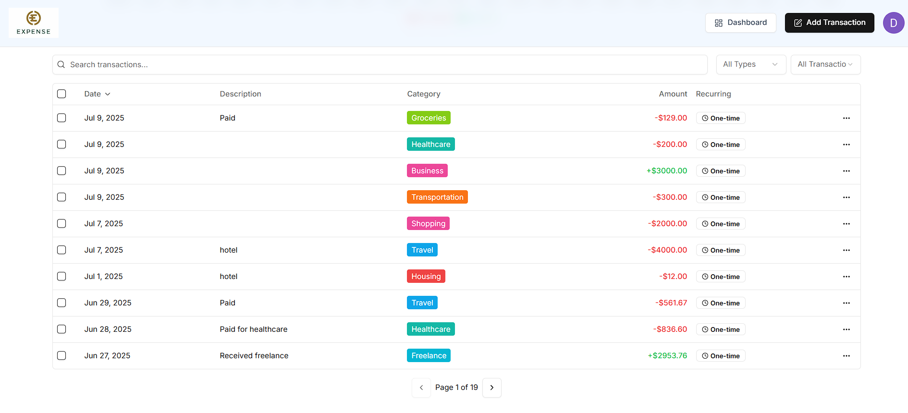

# WealthMind

WealthMind is a comprehensive financial management application designed to help users track their budgets, manage expenses, and achieve their financial goals.

## Features

- **Budget Tracking**: Monitor your spending and stay within your budget.
- **Expense Management**: Categorize and manage your expenses with ease.
- **Financial Goals**: Set and track your financial goals.
- **Reports and Insights**: Generate reports to gain insights into your financial habits.
- **AI Insights**: Leverage AI to provide personalized financial insights and recommendations.

## Installation

To set up the project locally, follow these steps:

1. Clone the repository:
   
   git clone [https://github.com/Dakshith99/Wealthmind.git](https://github.com/Dakshith99/Wealthmind.git)
2. Navigate to the project directory:
   
   cd Wealthmind

3. Install the dependencies:
   
   npm install  

4. Set up environment variables:
    
    eg: like .env
   

5. Start the development server:
   
   npm run dev

Usage
Open http://localhost:3000 in your browser to view the application.
Use the dashboard to manage your financial data and track your progress.

## Sample output 

## Technologies Used

- Next.js: For server-side rendering and static site generation.
- Supabase: As the database and authentication provider.
- prisma: For database schema and data modeling.
- Tailwind CSS: For styling the application.
- Clerk: For user authentication.
- Arcjet, Resend, Gemini: For additional integrations and API functionalities.
